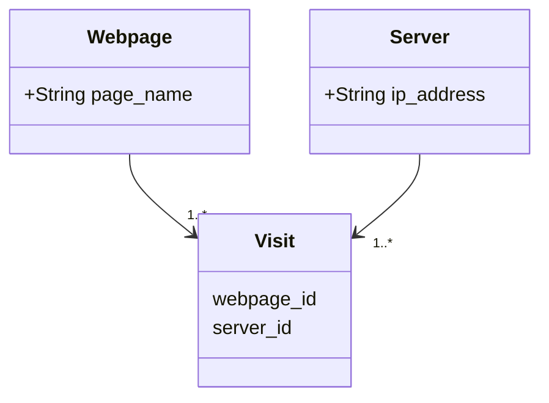

# README
This is a rails app for Smart Pension webserver test built on Ruby on Rails application

Ruby version **3.1.2**
Rails version **7.0.3**

## Setup
Pull / Checkout the changes and cd to the project directory
Run:

    bundle install
## Database creation
    rails db:migrate RAILS_ENV=development

## How to run the test suite
    rails db:migrate RAILS_ENV=test

	rails test

## Services
Scripts can be ran via a rake task
To import the file, run:

    rake webserver:import FILE=webserver.log

The input file should be put inside /public/import folder. No need to include path on argument

To get most page views, run:

    rake webserver:most_page_views

To get most unique page views, run:

    rake webserver:most_unique_page_views

## Design
This app is a minimal Rails Application to import and process a simple input file. No controller / view needed.
There are 3 models:

    Webpage
    Server
    Visit

